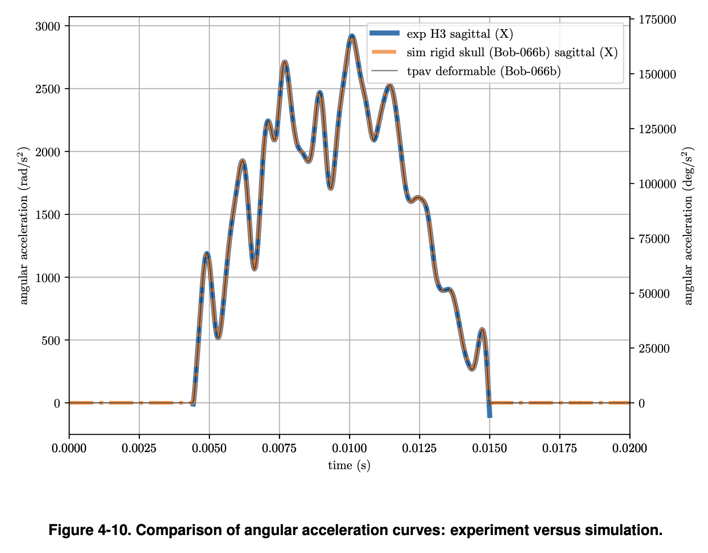
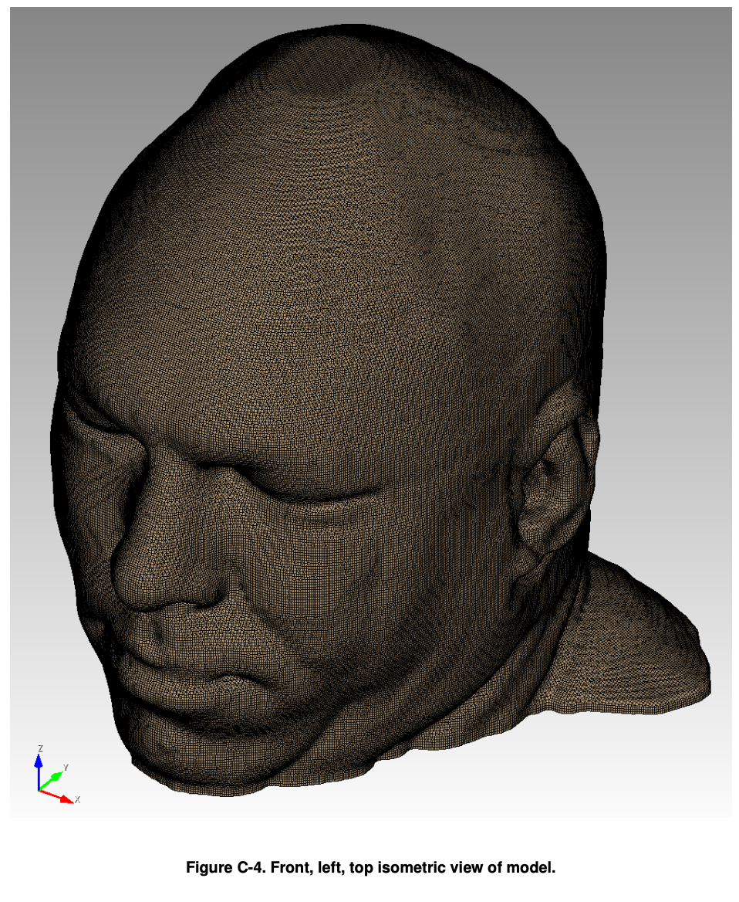
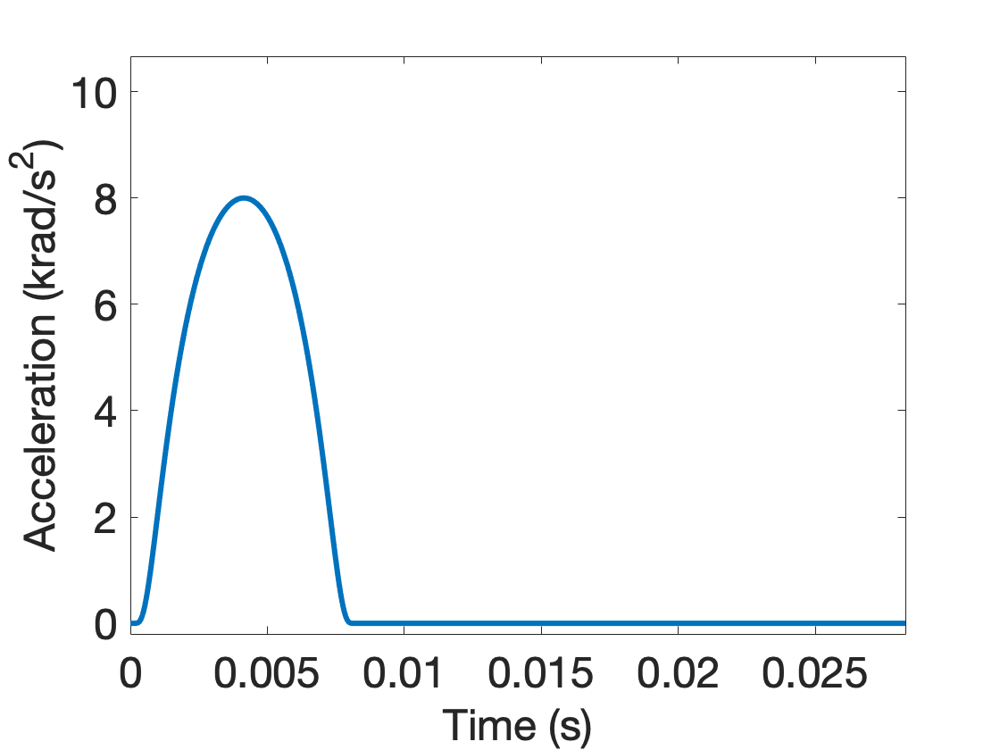
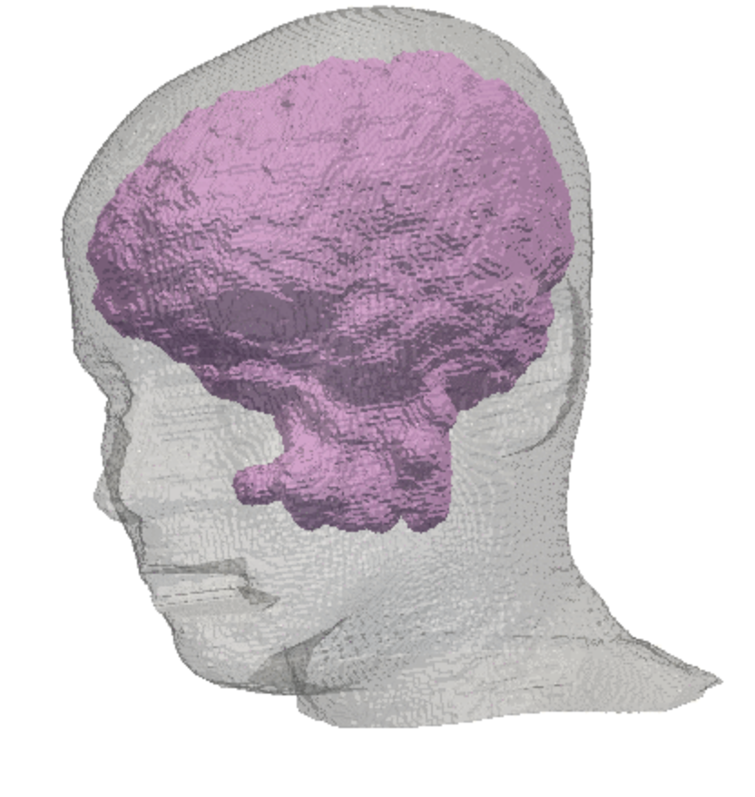
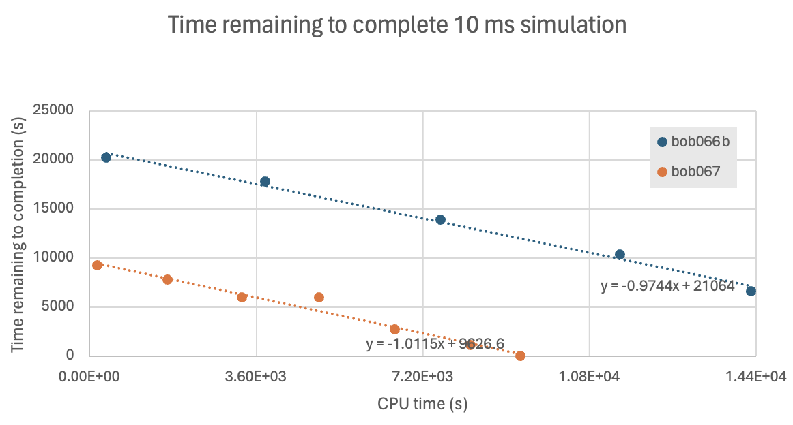
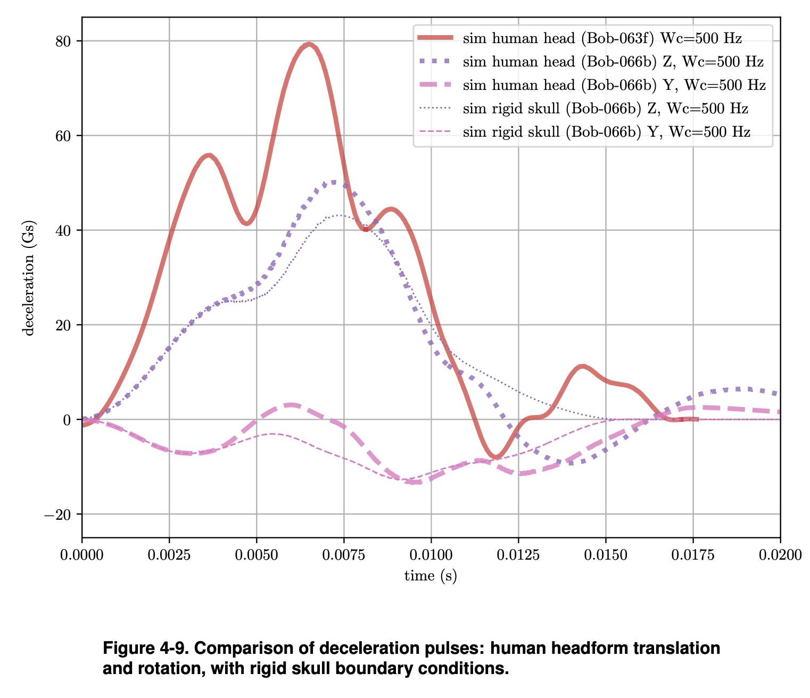
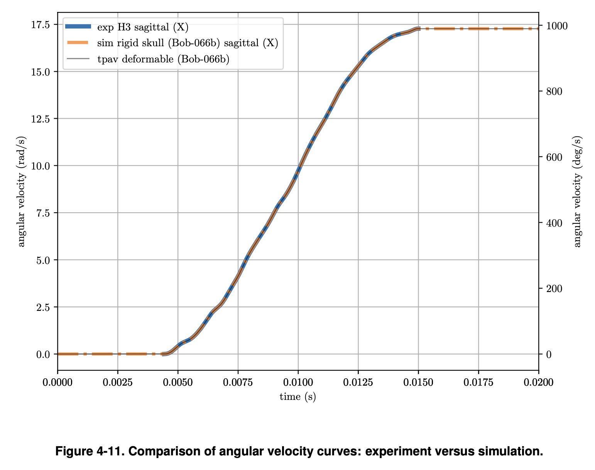

# ssm

Sierra Solid Mechanics simulations

## Goal

* Reproduce the *Mil Med* workflow.
* Substitute BCs: Compare RMU `8 krad/s` `8 ms` [boundary condition](https://github.com/autotwin/basis?tab=readme-ov-file#methods).
* Substitue mesh: Substitute Bob model with Autotwin [two material model](https://github.com/autotwin/pixel).

Boundary Condition | Mesh
:---: | :---:
 | 
| 

Figure 1: Reproduction of boundary condition and mesh figures.

### Mesh Characteristics

* The spheres mesh is 5,496,376 elements, 400 MB.
* The *Mil Med* mesh has 4,631,316 elements, 328 MB.
* The Utah SCI has xxx elements, xxx MB.

### Simulation Characteristics

Table 1: Simulation index. 

item | `sim` | mesh | bc (ms, krad/s) | T_sim (ms) | machine | # proc | cpu time (hh:mm) | wall time (days)
:---: | :---: | :---: | :---: | ---: | :---: | ---: | ---: | ---: 
0 | [`vox_0.1cm`](https://github.com/autotwin/basis?tab=readme-ov-file#voxel-meshes) | spheres | 8, 8 | 20 | skybridge | 160 | 01:43 | 11.5
1 | `bob066b` | Bob | 10, 3 | 6.57 | eclipse | 336 | 04:00 | 56.0
2 | `bob067` | Bob | 10, 3 | 10 | eclipse | 336 | 02:35 | 36.2
3 | `bob068` | Bob | 10, 3 | 20 | eclipse | 336 | hh:mm | hh:mm
4 | `bob069` | Bob | 10, 3 | 20 | eclipse | 700 | hh:mm | hh:mm
x | [`sci001`](https://github.com/autotwin/mesh/tree/main/doc/T1_Utah_SCI_brain) | T1 Utah SCI | 10, 3 | 5 | 6 | 7 | 8 | 9
x | 2 | 3 | 4 | 5 | 6 | 7 | 8 | 9



Figure 2: Analysis of time to completion for simulations. </br>Reference: `autotwin/ssm/analysis/simulaton_time_to_completion.xlsx` 

## References

* [casco_sim repo](https://cee-gitlab.sandia.gov/chovey/casco_sim)
* [Terpsma 2021 Mil Med](https://github.com/hovey/hovey.github.io/blob/master/docs/Terpsma_2021_001.pdf)
* [Terpsma 2020 SAND](https://github.com/hovey/hovey.github.io/blob/master/docs/Terpsma_2020_SAND2020_11444.pdf)
* [Minimum Working Example Utah brain Issue 19](https://github.com/autotwin/mesh/issues/19)

Axes | Figure
:---: | :---:
`X` axis is right to left ("yes" gesture head rotation).</br>`Z` axis is vertical (inferior to superior axis in Figure 4-9),</br> * `Y` axis horizontal (anterior to posterior axis in Figure 4-9).</br> | 

Linear Acceleration | Rotational Acceleration | Rotational Velocity
:--: | :--: | :--:
 |  | 

> *Figure #*  `Bob-066b` - Terpsma 2020 SAND, at page 22, Table 3-1, helmeted Bob onto inclined anvil is simulation reference `Bob-066b`.  Boundary condition: experimental angular velocity time history (Figure 4-11), which is a time integration of the angular acceleration time history (Figure 4-10), around `X` axis ("yes" gesture head rotation).

## Queue Reference

```bash
mywcid
sinfo
squeue -u chovey
squeue -u chovey --start
```

## SSM Questions

* Why does this no longer work:

```bash
echo "Check syntax of input deck: $IFILE"
adagio --check-syntax -i $IFILE  # to check syntax of input deck

# echo "Check syntax of input deck ($IFILE) and mesh loading"
adagio --check-input  -i $IFILE  # to check syntax of input deck and mesh load
```

* How do determine the number of equations being solved, not just the number of elements?
