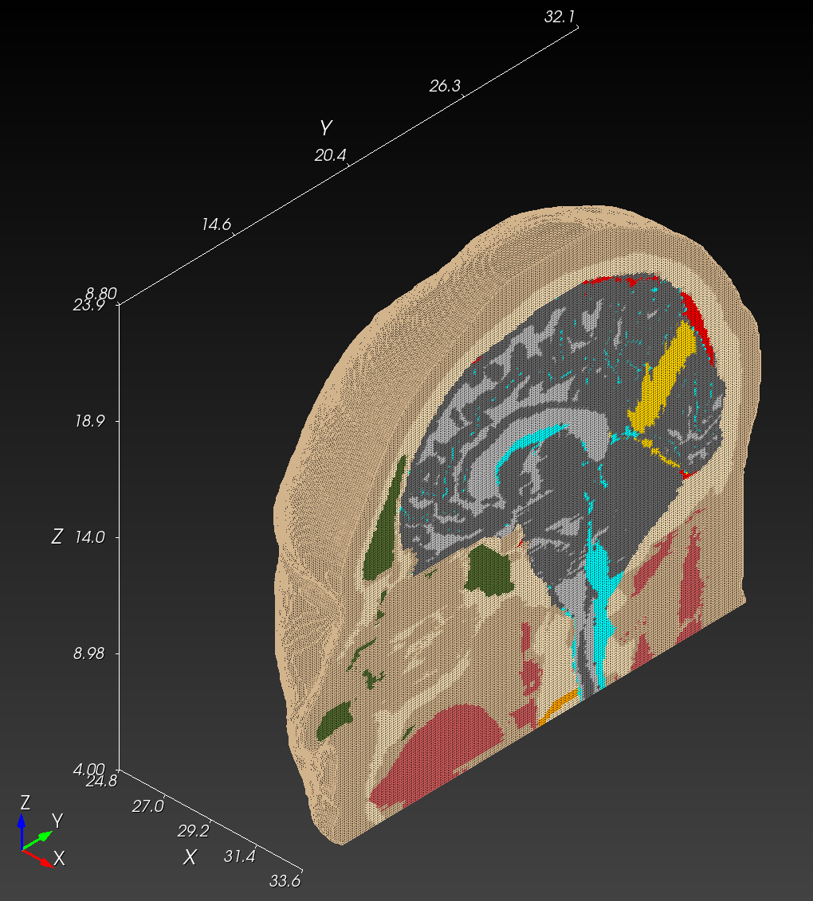
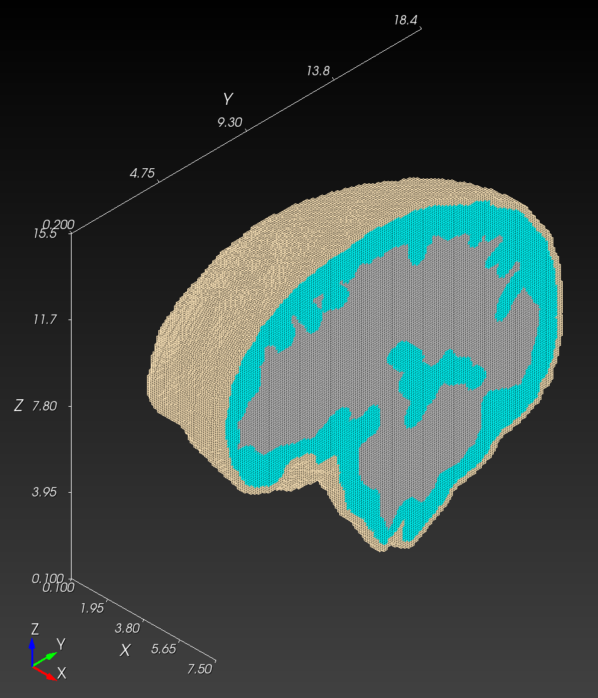
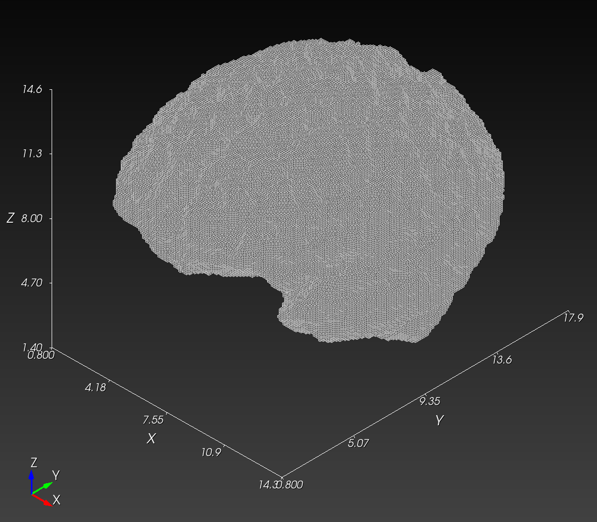
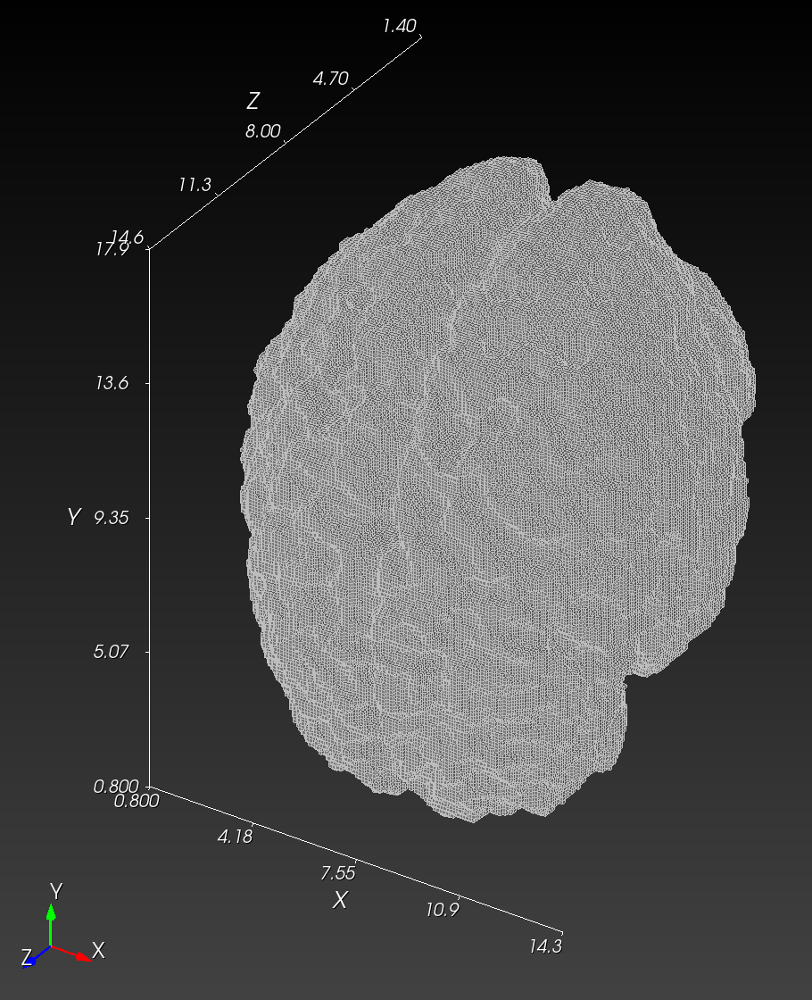

<style>
    .bone {
      background-color: #F5DEB3;
    }
    .disc {
      background-color: #FFA500;
    }
    .vasculature {
      background-color: #FF0000;
    }
    .airway_sinus {
      background-color: #556B2F;
    }
    .membrane {
      background-color: #FFD700;
    }
    .csf {
      background-color: #00FFFF;
    }
    .white_matter {
      background-color: #BEBEBE;
    }
    .gray_matter {
      background-color: #696969;
    }
    .muscle {
      background-color: #CD5C5C;
    }
    .skin {
      background-color: #D2B48C;
    }
</style>

# ssm

Sierra Solid Mechanics simulations

## Goal

* Reproduce the *Mil Med* workflow.
* Substitute BCs: Compare RMU `8 krad/s` `8 ms` [boundary condition](https://github.com/autotwin/basis?tab=readme-ov-file#methods).
* Substitute mesh: Substitute Bob model with Autotwin [three material model](https://github.com/autotwin/mesh/blob/main/doc/npy_to_mesh_part_3.md) (deprecated: [two material model](https://github.com/autotwin/pixel)).

Create a high-resolution mesh (1-mm^3 cubic element size) mesh:

```bash
cp ~/autotwin/mesh/tests/files/IXI012-HH-1211-T1_tiny_test.yml ~/autotwin/ssm/geometry/a001/.
cd ~/autotwin/ssm/geometry/a001
mv IXI012-HH-1211-T1_tiny_test.yml a001.yml
# edit a001.yml
```

* [a001.yml](geometry/a001/a001.yml)

```bash
# create the mesh
cd ~/autotwin/mesh
source .venv/bin/activate.fish
cd ~/autotwin/ssm/geometry/a001
npy_to_mesh a001.yml > a001.log

# manual copy from local to HPC
# macOS local finder, command+K to launch "Connect to Server"
# smb://cee/chovey
# copy [s1088757]~/autotwin/ssm/geometry/a001/a001.e.1.0 to [eclipse]~/autotwin/ssm/geometry/a001/a001.e.1.0
```

* [a001.log](geometry/a001/a001.log)

Boundary Condition | Mesh
:---: | :---:
 |   
|   

> Figure 1: Reproduction of boundary condition and mesh figures.

Note: View reproducibility in Cubit:

```bash
# example with bob
import mesh "/Users/chovey/autotwin/ssm/geometry/bob-1mm-5kg-helmet2-hemi.g" lite
# block 12 and higher, visibility set to off # gui command
graphics scale on
view iso
view up 0 0 1 # z-axis up
view from 1000 -1000 1000

help clip
  Graphics Clip {on|off} [ Plane <options> | [Location <location>] [Direction <direction>]]
  Graphics Clip Manipulation {on|off}

# graphics clip on location (42.3 - 24.8)/2 + 24.8 (32.1 - 8.8)/2 + 8.0 (23.9 - 4.0)/2 + 4.0 direction -1 0 0
# graphics clip on location 33.55 20.45 13.95 direction -1 0 0
# reference page 73 of Terpsma 2020 SAND report for x-axis cut plane
graphics clip on location 33.6315 0 0 direction -1 0 0
graphics clip manipulation off

# example with a001
Cubit>
import mesh "/Users/chovey/autotwin/ssm/geometry/a001/a001.e.1.0" lite
# block 4 visibility off # gui command
graphics scale on
view iso
view up 0 0 1 # z-axis up
view from 1000 -1000 1000

# graphics clip on location 15.5/2 18.5/2 15.5/2 direction -1 0 0 # center point of the domain in a001.log
graphics clip on location 7.55 9.25 7.75 direction -1 0 0 # center point of the domain in a001.log
graphics clip manipulation off
```

### Mesh Characteristics

* The spheres mesh is 5,496,376 elements, 400 MB.
* The *Mil Med* mesh has 4,631,316 elements, 328 MB.
* The a001 (IXI012-HH-1211-T1_large.npy -> a001.e.1.0) has 4,329,925 elements (2,389,783 void block 0, 240,895 bone block 1, 448,654 csf block 2, 1,250,593 brain block 3), 220 MB (see [table](https://github.com/autotwin/mesh/blob/main/doc/npy_to_mesh_part_3.md)).

### Simulation Characteristics

> Table 1: Simulation index. 

item | `sim` | mesh | bc (ms, krad/s) | T_sim (ms) | machine | # proc | cpu time (hh:mm) | wall time (days)
:---: | :---: | :---: | :---: | ---: | :---: | ---: | ---: | ---: 
0 | [`vox_0.1cm`](https://github.com/autotwin/basis?tab=readme-ov-file#voxel-meshes) | spheres | 8, 8 | 20 | skybridge | 160 | 01:43 | 12
1 | `bob066b` | Bob | 10, 3 | 6.57 | eclipse | 336 | 04:00 | 56
2 | `bob067` | Bob | 10, 3 | 10 | eclipse | 336 | 02:35 | 36


> Figure 2: Analysis of time to completion for simulations. </br>Reference: `autotwin/ssm/analysis/simulaton_time_to_completion.xlsx` 

item | `sim` | mesh | bc (ms, krad/s) | T_sim (ms) | machine | # proc | cpu time (hh:mm) | wall time (days)
:---: | :---: | :---: | :---: | ---: | :---: | ---: | ---: | ---: 
3 | `bob068` | Bob | 10, 3 | 20 | eclipse | 336 | 05:57 | 83
4 | `bob069` | Bob | 10, 3 | 20 | eclipse | 700 | 04:00 | 117
. | - | - | - | - | - | - | - | -


### Pixel toward Ensemble

> Table 2: Pixel semantic values, anatomy, and color.

integer | anatomy | color
:---: | --- | ---
0 | void | dark blue
1 | skull | light blue
2 | CSF | green
3 | brain | yellow

> Table 3: Pixel semantic values, anatomy, and color.

size | dimension
--- | ---
Large | (256, 256, 150)
Medium | (128, 128, 75)
Small | (64, 64, 38)
Mini | (26, 26, 15)


> Figure 3: Sagittal section view of four sizes.  [Link to file download](https://drive.google.com/drive/folders/158MXz03QCuockuRoSBpY-YuO4fni3RVD).

## References

* [casco_sim repo](https://cee-gitlab.sandia.gov/chovey/casco_sim)
* [Terpsma 2021 Mil Med](https://github.com/hovey/hovey.github.io/blob/master/docs/Terpsma_2021_001.pdf)
* [Terpsma 2020 SAND](https://github.com/hovey/hovey.github.io/blob/master/docs/Terpsma_2020_SAND2020_11444.pdf)
* [Minimum Working Example Utah brain Issue 19](https://github.com/autotwin/mesh/issues/19)

Axes | Figure
:---: | :---:
`X` axis is right to left ("yes" gesture head rotation).</br>`Z` axis is vertical (inferior to superior axis in Figure 4-9),</br> * `Y` axis horizontal (anterior to posterior axis in Figure 4-9).</br> | 

Linear Acceleration | Rotational Acceleration | Rotational Velocity
:--: | :--: | :--:
 |  | 

> Figure 4  `Bob-066b` - Terpsma 2020 SAND, at page 22, Table 3-1, helmeted Bob onto inclined anvil is simulation reference `Bob-066b`.  Boundary condition: experimental angular velocity time history (Figure 4-11), which is a time integration of the angular acceleration time history (Figure 4-10), around `X` axis ("yes" gesture head rotation).

## Color Codes

| R     | G     | B     | R   | G   | B   | Block | Hex    |
| ----- | ----- | ----- | --- | --- | --- | :---: | ------ |
| 0.961 | 0.871 | 0.702 | 245 | 222 | 179 | <div class="bone">1</div>     | F5DEB3 |
| 1     | 0.647 | 0     | 255 | 165 | 0   | <div class="disc">2</div>     | FFA500 |
| 1     | 0     | 0     | 255 | 0   | 0   | <div class="vasculature">3</div>     | FF0000 |
| 0.333 | 0.42  | 0.184 | 85  | 107 | 47  | <div class="airway_sinus">4</div>     | 556B2F |
| 1     | 0.843 | 0     | 255 | 215 | 0   | <div class="membrane">5</div>     | FFD700 |
| 0     | 1     | 1     | 0   | 255 | 255 | <div class="csf">6</div>     | 00FFFF |
| 0.745 | 0.745 | 0.745 | 190 | 190 | 190 | <div class="white_matter">7</div>     | BEBEBE |
| 0.412 | 0.412 | 0.412 | 105 | 105 | 105 | <div class="gray_matter">8</div>     | 696969 |
| 0.804 | 0.361 | 0.361 | 205 | 92  | 92  | <div class="muscle">9</div>     | CD5C5C |
| 0.824 | 0.706 | 0.549 | 210 | 180 | 140 | <div class="skin">10</div>    | D2B48C |


## Queue Reference

```bash
mywcid
sinfo
squeue -u chovey
squeue -u chovey --start
```

## SSM Questions

* Why does this no longer work:

```bash
# new, run this first
export PSM2_DEVICES='shm,self'
# then

# DRY code
IFILE="bob069.i"

echo "Check syntax of input deck: $IFILE"
adagio --check-syntax -i $IFILE  # to check syntax of input deck

# echo "Check syntax of input deck ($IFILE) and mesh loading"
adagio --check-input  -i $IFILE  # to check syntax of input deck and mesh load
```

* How do determine the number of equations being solved, not just the number of elements?


## Appendix

The two-material model from the `pixel` repo is now deprecated

in favor of the three-material model from the `ensemble` repo.